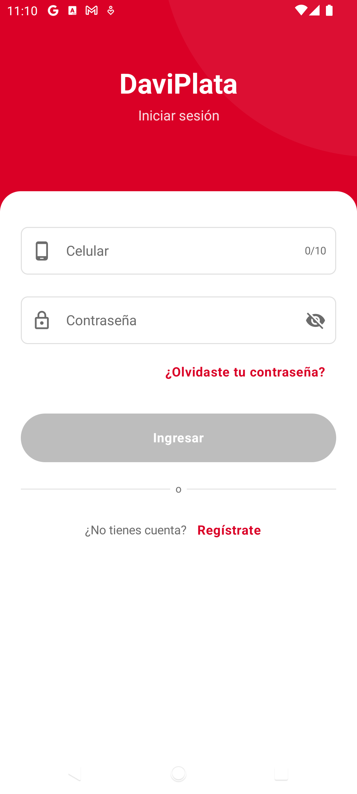
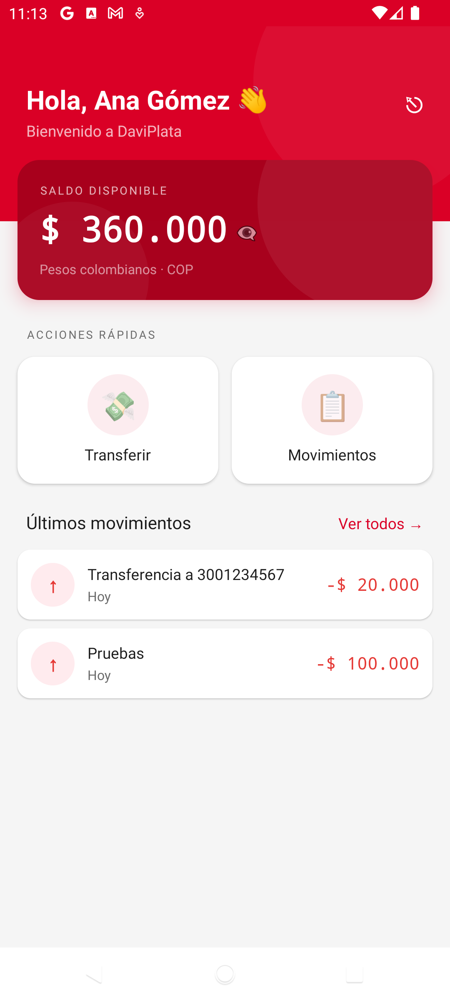
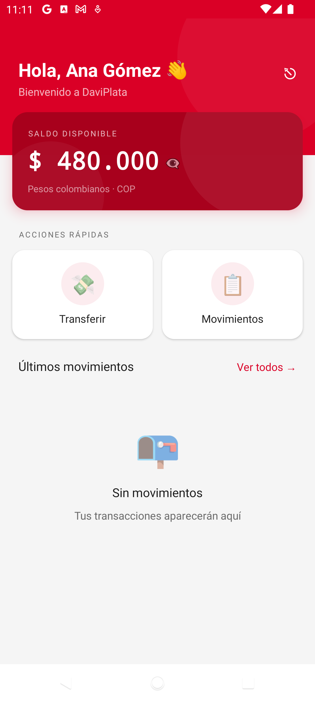
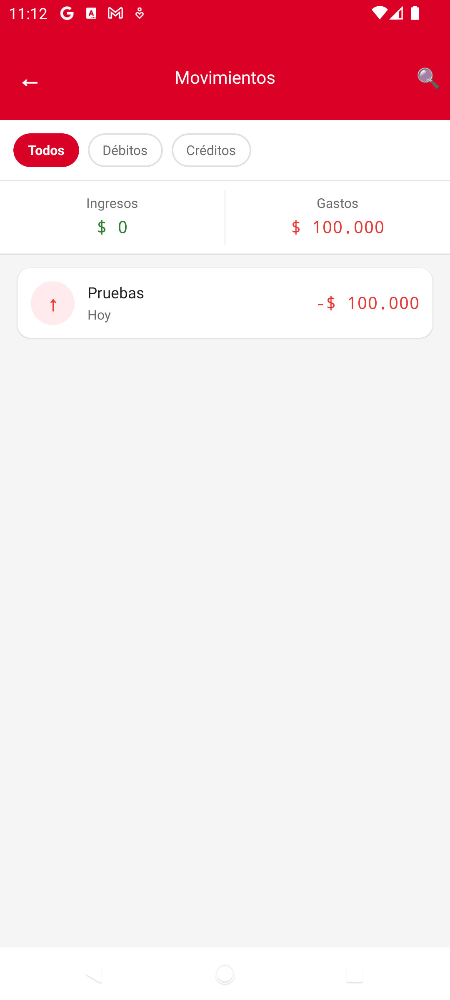
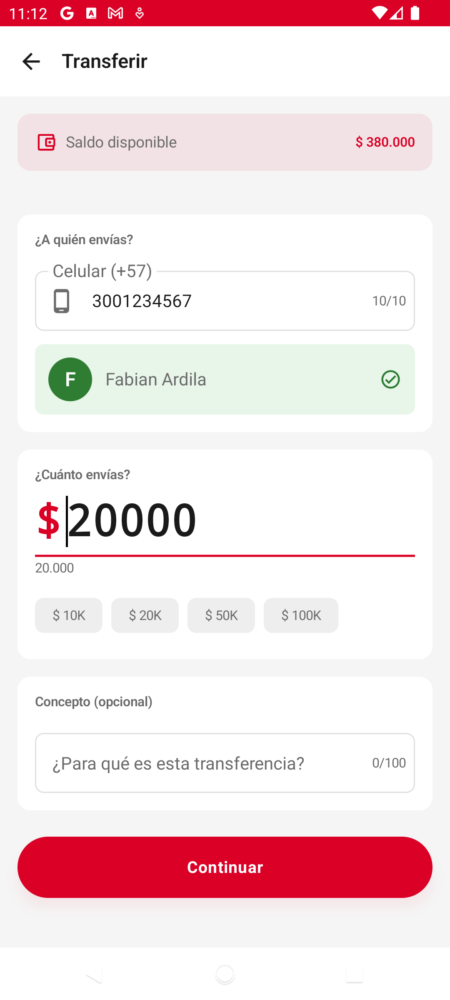
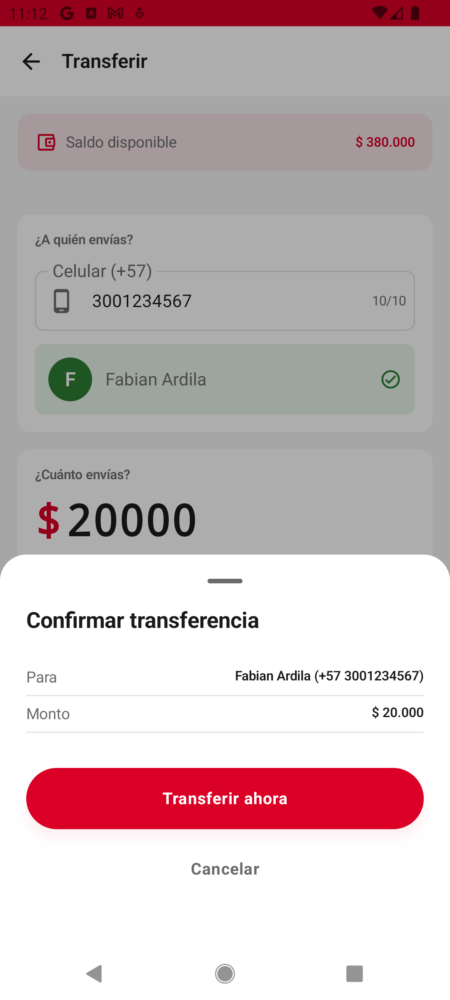
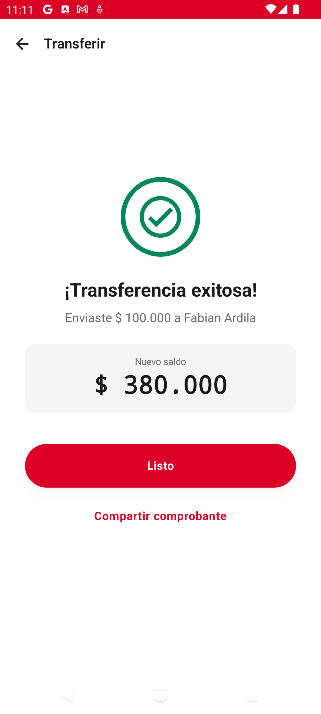

# DaviPlata — Prueba Técnica Mobile Android

> **Aspirante:** Fabian Guillermo Ardila Castro
> **Cargo:** Especialista II Android
> **Empresa:** Davivienda — DaviPlata
> **Fecha de entrega:** Domingo 17 de mayo de 2026
> **Contacto:** fgardila@outlook.com

---

## Qué hay aquí

Una app Android híbrida (Kotlin nativo + bundle React Native montado vía Bridge clásico) que simula el flujo financiero núcleo de DaviPlata: registro, login, consulta de saldo, transferencias, movimientos y logout. El "shell" es Android nativo (Splash, Login, Registro, Transferencias, Sesión expirada), y dentro de él se monta un bundle RN que renderiza Home y Movimientos. La comunicación cruzada usa **Native Modules** (`@ReactMethod`) + `RCTDeviceEventEmitter` + `initialProperties` — explícitamente.

Backend es un mock determinista en proceso (`MockInterceptor` + `MockDataStore`) — no requiere servidor externo. Esto permite que la prueba sea reproducible, ejecutable offline, y exhibe los códigos de error reales (401, 409, 423, 500) que un backend de producción produciría.

---

## Demo en 60 segundos

```bash
# 1. Build debug (genera bundle RN automáticamente para release; en debug usa Metro o bundle precompilado)
./gradlew assembleDebug

# 2. Instalar en emulador o dispositivo conectado
./gradlew installDebug

# 3. Credenciales de prueba (sembradas en MockDataStore)
#    Usuario A:   3001234567 / demo1234   (saldo $1.250.345, con 12 movimientos)
#    Usuario B:   3009876543 / demo1234   (saldo $480.000, sin movimientos)
```

Para forzar errores específicos durante la demo: header `X-Mock-Force: 500` en cualquier request fuerza un 500, hay 3 intentos máximos antes de `423 ACCOUNT_LOCKED`, y en debug hay un botón **"Forzar sesión expirada"** en el Home RN para validar el flujo `SessionExpired`.

---

## Capturas y video

### Video demo (flujo end-to-end)

[`screenshots/record-daviplata.mp4`](screenshots/record-daviplata.mp4) — grabación corta que recorre login → home → movimientos → transferencia → confirmación → éxito → vuelta a home con saldo actualizado.

### Autenticación

| Login (nativo Kotlin/Compose) |
|---|
|  |

Pantalla del shell nativo. Validación inline vía `Validators.kt`, errores 401 del mock backend renderizados sin redirigir a `SessionExpiredActivity` (gracias a la lista blanca `AUTH_ENDPOINTS` en `AuthInterceptor`).

### Home (React Native montado sobre `ReactRootView`)

| Home con saldo + movimientos | Home sin movimientos |
|---|---|
|  |  |

Bundle RN renderizando `HomeScreen`. El saldo y los movimientos se obtienen vía Native Modules (`getBalance()`, `getMovements()`); React Query cachea y se invalida automáticamente al recibir `TRANSFER_COMPLETED` / `BALANCE_UPDATED` desde nativo.

### Movimientos (React Native, paginado)

| Lista de movimientos |
|---|
|  |

`MovementsScreen` consume `useMovementsQuery` con paginación; los datos vienen del `MockDataStore` a través del bridge.

### Flujo de transferencia (nativo Kotlin/Compose)

| 1. Formulario | 2. Confirmación | 3. Éxito |
|---|---|---|
|  |  |  |

`TransferActivity` es Activity independiente (no parte del single-Activity del pre-Home), lanzada desde RN vía `openTransfer(payload)`. Tras `submit`, el VM emite `TRANSFER_COMPLETED` por `RCTDeviceEventEmitter`, RN invalida `useBalanceQuery` y el Home muestra el saldo nuevo sin pull-to-refresh manual.

---

## Stack y versiones

Fuente de verdad: `gradle/libs.versions.toml`.

| Componente | Versión | Por qué |
|---|---|---|
| Kotlin | 2.2.10 | K2 estable, requerido por Compose Compiler bundled en BOM 2026.02.01 |
| AGP | 9.2.1 | Compatible con Apple Silicon y `compileSdk` 36 |
| Gradle | 9.4.1 | Requerido por AGP 9.x |
| Compose BOM | 2026.02.01 | Drives todas las versiones `androidx.compose.*` alineadas |
| Navigation Compose | 2.8.5 | Type-safe routes con `@Serializable` |
| Hilt | 2.59.2 | Compatible con KSP (este proyecto no usa KAPT en absoluto) |
| KSP | 2.2.10-2.0.2 | Reemplaza KAPT para Hilt y Moshi codegen |
| Retrofit / OkHttp | 2.9.0 / 4.12.0 | Moshi 1.15.2 para serialización |
| Coroutines | 1.11.0 | Base de todo el flujo asíncrono |
| security-crypto | 1.1.0 | `EncryptedSharedPreferences` (deprecada upstream, usada por simplicidad) |
| core-splashscreen | 1.2.0 | Splash API moderno (Android 12+) con icono `ic_launcher_foreground` |
| React Native | 0.79.7 | Última RN compatible con Kotlin 2.2 + Compose BOM 2026 que aún honra `newArchEnabled=false`. 0.80+ congeló la legacy; 0.82+ la eliminó |
| React | 19.0.0 | Empaquetado con RN 0.79 |
| compileSdk / targetSdk | 36 (`minorApiLevel=1`) | Android 16 |
| minSdk | 28 | Android 9.0 |
| JDK | 17 (arm64) | Zulu o Temurin ARM64 |
| Node.js | 20 LTS | Requerido por toolchain RN 0.79 |

---

## Arquitectura

Clean Architecture estricta en 3 capas, con DI vía Hilt:

```
presentation  ──▶  domain  ◀──  data
                      │
                      ▼
                   di (Hilt)
```

- **`presentation/`** — Activities, ViewModels (`StateFlow<UiState>`), Composables. Solo conoce UseCases.
- **`domain/`** — Kotlin puro. Models, interfaces `Repository`, `UseCase`. Cero imports de Android.
- **`data/`** — `*RepositoryImpl`, `ApiService` (Retrofit), DTOs, `SecureStorage`. Sin lógica de negocio.
- **`di/`** — Módulos Hilt `@Binds`.
- **`security/`** y **`bridge/`** — cross-cutting; el bridge delega a UseCases vía un `EntryPoint` para evitar `@AndroidEntryPoint` en clases que RN instancia por reflection.

Decisión que vale la pena explicar:

### Single-Activity Architecture con Navigation Compose y type-safe routes

`DaviPlataActivity` es el único Activity para el pre-Home (Splash + Login + Register). Rutas type-safe:

```kotlin
sealed interface AppRoute {
    @Serializable data object Splash : AppRoute
    @Serializable data object Login : AppRoute
    @Serializable data object Register : AppRoute
}
```

`AppCoordinator` orquesta la navegación, las pantallas son Composables stateless (`*Route` = stateful + `hiltViewModel()`; `*Screen` = UI pura). `HomeReactActivity`, `TransferActivity` y `SessionExpiredActivity` siguen siendo Activities independientes — `HomeReactActivity` porque `ReactActivity` tiene lifecycle propio del bridge RN; las otras dos por contención de scope.

### `SessionRepository` reactivo

Expone `sessionFlow: Flow<Session?>` además de `current()`, `save()`, `clear()`. Internamente un `MutableStateFlow` inicializado desde `EncryptedSharedPreferences`. Permite a cualquier consumidor reaccionar al cambio de sesión sin re-leer disco — útil para `SplashViewModel` y potencialmente para validaciones reactivas futuras.

### `SplashScreen` API moderno + Compose splash

`installSplashScreen()` en `DaviPlataActivity.onCreate` muestra el icono del app durante el cold start (Android 12+). Un `MutableStateFlow<Boolean>` a nivel Activity gobierna `setKeepOnScreenCondition`: el splash del sistema se mantiene hasta que `SplashViewModel` termine la validación de seguridad + sesión. Cuando el VM emite `NavigateToLogin` / `NavigateToHome` / `Blocked`, el splash del sistema se desmonta, el `postSplashScreenTheme` se aplica al window, y `AppNavHost` muestra el destino correcto sin flash blanco.

### `Validators` centralizados

`domain/validation/Validators.kt` es la única fuente de verdad para reglas de input (teléfono, password, email, document, username, amount). Devuelve `String?` (null = válido, string = mensaje listo para mostrar). Lo consumen 4 UseCases + 3 Screens + 2 ViewModels. Cubierto por `ValidatorsTest` con 17 casos. Antes había duplicación literal en 6 sitios para `phone.length == 10`.

### `AuthInterceptor` con pre-validación

Antes de `chain.proceed`, si `SessionGuard.isExpired() && !isAuthEndpoint`, retorna un `Response` 401 sintético sin pegarle al backend. El cuerpo JSON tiene el mismo shape que produce `MockInterceptor` para `SESSION_EXPIRED`, así que `ErrorMapper` lo mapea correctamente a `AppError.SessionExpired` aguas abajo. Defensa en profundidad: el handler post-401 sigue activo como red de seguridad si el backend rechaza un sessionId revocado.

`/api/auth/login` y `/api/auth/register` están en una lista blanca (`AUTH_ENDPOINTS`) — un 401 ahí significa "credenciales inválidas", no sesión expirada, y debe llegar limpio al `LoginViewModel` para renderizar inline en el formulario. Sin esa lista blanca, cualquier intento fallido de login mandaba al usuario a `SessionExpiredActivity` (bug encontrado y corregido).

### React Query del lado RN

El bundle JS usa `@tanstack/react-query` 5.x para gestionar caché. `useBalanceQuery` y `useMovementsQuery` se invalidan reactivamente al recibir `TRANSFER_COMPLETED` / `BALANCE_UPDATED` (eventos emitidos desde nativo vía `RCTDeviceEventEmitter`), y se limpian completamente con `SESSION_EXPIRED`. Esto evita pull-to-refresh manual tras una transferencia.

---

## Cómo correr el proyecto

### Setup inicial

Requiere Node 20+, JDK 17 ARM64 y Android Studio.

```bash
# 1. Instalar deps de RN
cd rn-bundle
npm install
cd ..
```

### Desarrollo con Metro (hot reload)

```bash
# Terminal 1 — Metro
cd rn-bundle
npx react-native start

# Terminal 2 — Build e instalar
./gradlew installDebug
```

### Build sin Metro (dispositivo físico o demo)

El bundle JS debe estar embebido en el APK. Para debug se hace manualmente; para release Gradle lo automatiza:

```bash
# Bundle manual (solo necesario para debug builds en dispositivo físico sin Metro)
cd rn-bundle
npx react-native bundle \
  --platform android \
  --dev false \
  --entry-file index.js \
  --bundle-output ../app/src/main/assets/index.android.bundle \
  --assets-dest ../app/src/main/res/
cd ..
./gradlew clean assembleDebug
```

### Build de release

El task `bundleReactRelease` está cableado a `preReleaseBuild` vía `afterEvaluate`, así que un solo comando hace todo:

```bash
./gradlew assembleRelease
# APK: app/build/outputs/apk/release/app-release.apk
```

---

## Comandos útiles

```bash
# Tests unitarios Kotlin
./gradlew :app:testDebugUnitTest

# Test específico
./gradlew :app:testDebugUnitTest --tests "dev.code93.daviplata.ValidatorsTest"

# Tests JS
cd rn-bundle && npx jest

# Lint TypeScript
cd rn-bundle && npx tsc --noEmit

# Verificar setup RN
cd rn-bundle && npx react-native doctor

# Logs JS de la app en ejecución
npx react-native log-android

# Reset cache de Metro si hay errores "Unable to resolve module"
cd rn-bundle && npx react-native start --reset-cache

# Build limpio
./gradlew clean
```

---

## Comunicación Android ↔ React Native

### RN → Android (Native Modules, vía `@ReactMethod`)

| Método | Payload | Retorno (Promise) | Implementación |
|---|---|---|---|
| `getBalance()` | — | `{ amount, currency }` | `DaviPlataBridgeModule.kt:34` |
| `getMovements(page, size)` | `Int, Int` | `{ items: [...], total, page }` | `DaviPlataBridgeModule.kt:52` |
| `openTransfer(payload)` | `ReadableMap` | `void` | Lanza `TransferActivity` vía Intent |
| `logout()` | — | `void` | Clear session + relanza `DaviPlataActivity` |
| `forceSessionExpired()` | — | `void` | Solo debug, fuerza expiración para QA |

### Android → RN (`RCTDeviceEventEmitter`)

| Evento | Cuándo | Consumidor JS |
|---|---|---|
| `SESSION_EXPIRED` | `AuthInterceptor` detecta 401 o sesión vencida | `App.tsx` limpia cache de React Query |
| `TRANSFER_COMPLETED` | `TransferViewModel.submit` éxito | `useBalanceQuery` invalida y refetch |
| `BALANCE_UPDATED` | Cuando el saldo cambia server-side | `useBalanceQuery` invalida |

### `LOAD_HOME` (la spec lo nombra, aquí está cubierto vía `initialProperties`)

El enunciado pide un evento `LOAD_HOME`. En este proyecto el equivalente funcional es `HomeReactActivity.getLaunchOptions()`, que monta el `ReactRootView` con `{ screen: "HOME", userId, name }` como `initialProperties`. Esto es semánticamente "Android cargó Home" pero implementado con props iniciales en vez de evento — patrón estándar del bridge clásico cuando el dato vive antes de que el bundle exista.

---

## Estructura del repo

```
daviplata/
├── app/                                        # Módulo Android Kotlin
│   └── src/main/java/dev/code93/daviplata/
│       ├── DaviPlataApp.kt                     # @HiltAndroidApp + SoLoader + ReactNativeHost
│       ├── presentation/                       # ── PRESENTATION ──────────────
│       │   ├── DaviPlataActivity.kt            # Single Activity (Splash + Auth)
│       │   ├── navigation/                     # AppRoute, AppCoordinator, AppNavGraph
│       │   ├── splash/                         # SplashRoute + SplashViewModel + SplashScreen
│       │   ├── auth/login|register/            # Route + Screen + ViewModel por feature
│       │   ├── home/HomeReactActivity.kt       # Hosts ReactRootView
│       │   ├── transfer/                       # TransferActivity + Screen + ViewModel
│       │   └── session/SessionExpiredActivity
│       ├── domain/                             # ── DOMAIN (Kotlin puro) ──────
│       │   ├── common/                         # ApiResult, AppError
│       │   ├── model/                          # Session, Balance, Movement, Transfer, ...
│       │   ├── repository/                     # Interfaces
│       │   ├── usecase/{auth,session,...}/
│       │   └── validation/Validators.kt        # Reglas reutilizables
│       ├── data/                               # ── DATA ──────────────────────
│       │   ├── remote/api/ApiService.kt        # Retrofit
│       │   ├── remote/dto/                     # DTOs (uno por archivo)
│       │   ├── remote/error/                   # ErrorMapper, apiFlow helper
│       │   ├── remote/mock/                    # MockInterceptor + MockDataStore
│       │   ├── remote/AuthInterceptor.kt       # Pre + post 401 handler
│       │   ├── local/SecureStorage.kt          # EncryptedSharedPreferences
│       │   └── repository/                     # *RepositoryImpl
│       ├── di/                                 # Hilt modules
│       ├── security/                           # SessionGuard, RootDetector, ...
│       ├── bridge/                             # DaviPlataBridgeModule, EventBus, ...
│       └── ui/
│           ├── common/                         # PrimaryButton, AlertBanner, ...
│           ├── common/screens/ResultOverlay.kt # Success/Error genéricos
│           └── theme/                          # Color, Type, Spacing, Theme
├── rn-bundle/                                  # Módulo React Native (TypeScript)
│   ├── App.tsx                                 # Router HOME ↔ MOVEMENTS
│   ├── index.js
│   └── src/
│       ├── screens/                            # HomeScreen, MovementsScreen
│       ├── components/                         # BalanceCard, MovementItem, ...
│       ├── services/nativeApi.ts               # Wrapper tipado sobre NativeModules
│       ├── bridge/                             # events.ts, types.ts
│       ├── hooks/                              # useBalanceQuery, useMovementsQuery, ...
│       └── lib/queryClient.ts                  # React Query setup
└── doc/                                        # Arquitectura, plan, diagramas
```

---

## Seguridad

- **`EncryptedSharedPreferences`** con `AES256_SIV` (keys) + `AES256_GCM` (values), respaldado por `MasterKey` en Android Keystore.
- **BCrypt cost-10** para hash de passwords (solo en el mock backend; nunca pasa al cliente).
- **Sesión NO incluye password**: solo `sessionId` + claims básicos. El bridge `initialProperties` lleva únicamente `userId` y `name`.
- **`SessionGuard.ensureValid()` + `AuthInterceptor`** validan antes de cada request; 401 dispara `SessionExpiredActivity` con `FLAG_ACTIVITY_CLEAR_TASK`.
- **`RootDetector` (RootBeer)** + **`EmulatorDetector`** se chequean en `SplashViewModel`; emulador permitido en debug, bloqueado en release.
- **ProGuard/R8** habilitado en release con `proguard-rules.pro` que preserva clases del bridge RN (`@ReactMethod`, `com.facebook.react.bridge.*`), Hilt y Moshi adapters.
- **`network_security_config.xml`** con `cleartextTrafficPermitted=false` por defecto; localhost/10.0.2.2 solo para dev (Metro).
- **Secrets en `local.properties`** (gitignored), inyectados como `BuildConfig` fields. Nada quemado en código.

---

## Tests

Suite unitaria de Kotlin (`./gradlew :app:testDebugUnitTest`):

| Test | Cobertura |
|---|---|
| `ValidatorsTest` | 17 casos cubriendo todas las reglas de input |
| `CreateTransferUseCaseTest` | Path feliz + validaciones (phone, amount) emitiendo `Failure(Validation)` |
| `SessionGuardTest` | `isExpired`, `ensureValid` con session presente/ausente/vencida |
| `MockInterceptorTest` | Login, lockout, paginación de movimientos, errores HTTP |
| `ErrorMapperTest` | Tabla completa (HTTP code, server code) → `AppError` |

Cobertura crítica estimada: ~55% de la lógica de negocio. La capa `presentation/` (ViewModels y reducers) tiene cobertura ligera — un siguiente paso natural sería agregar tests de `LoginViewModel`/`RegisterViewModel`/`TransferViewModel` con `runTest` y fake UseCases.

Lado JS (`cd rn-bundle && npx jest`):

| Test | Cobertura |
|---|---|
| `formatCurrency.test.ts` | Formateo COP |
| `useBalance.test.tsx` | Hook con mock del bridge |

---

## Documentación adicional

| Documento | Contenido |
|---|---|
| `doc/arquitectura.md` | ADRs (Architecture Decision Records) — por qué Clean, por qué Hilt, por qué Bridge clásico |
| `doc/diagrama-componentes.mmd` | Diagrama Mermaid de componentes |
| `doc/diagrama-secuencia-login.mmd` | Secuencia: cold start → splash → login → home RN |
| `doc/diagrama-secuencia-transferencia.mmd` | Secuencia: Home RN → openTransfer → TransferActivity → TRANSFER_COMPLETED |

Para visualizar los `.mmd`: VS Code con extensión "Markdown Preview Mermaid Support", o `npm install -g @mermaid-js/mermaid-cli && mmdc -i doc/diagrama-componentes.mmd -o componentes.png`.

---